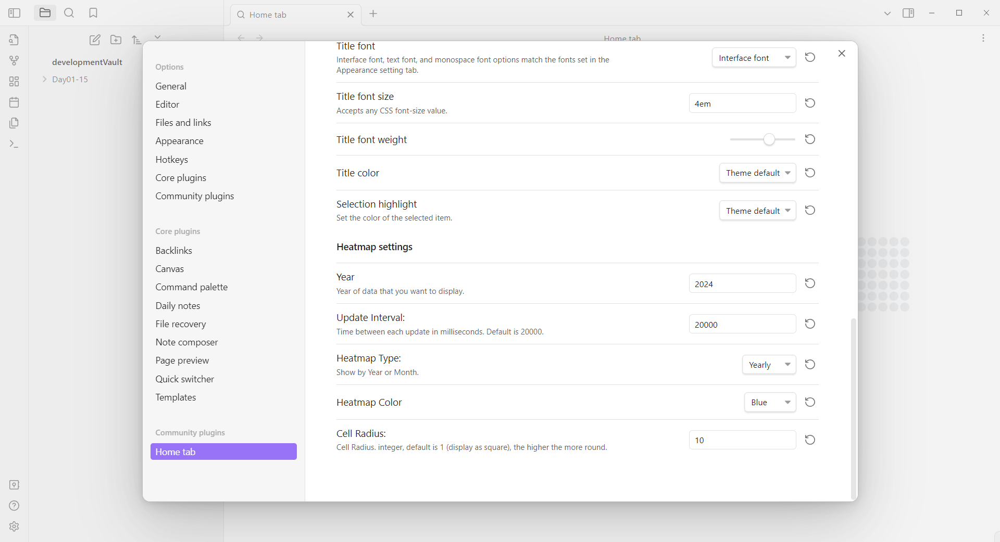
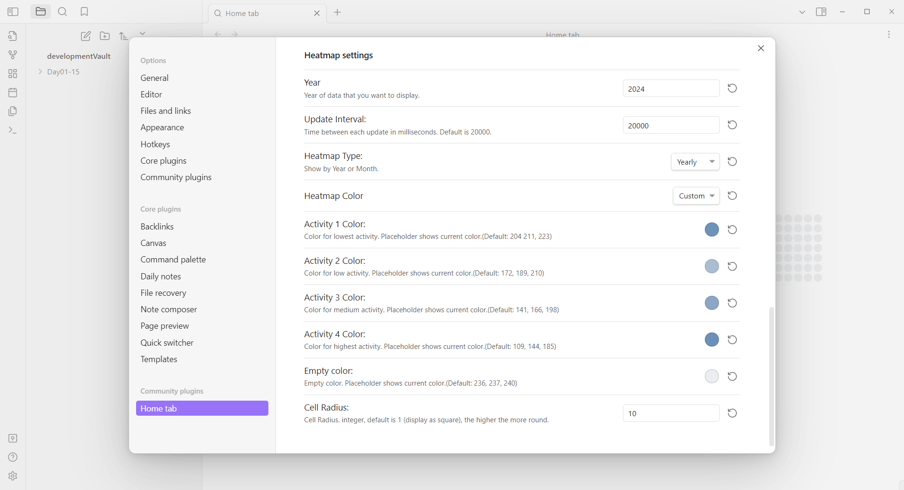

# Obsidian Home Tab & Activity History

Home Tab 插件魔改，在 Home Tab 插件的 New Tab 界面下方添加了 Activity History 插件用到的 svelte-heatmap。热力图每20s记录库的 md 文件的总字节大小变化来确定颜色深浅，间隔时间可以自行设置。和 Acitivity History 一样，该插件只能记录从安装了插件之后的文件大小变化。

觉得好用也可以给这三个项目点点 star。

- [olrenso/obsidian-home-tab: A browser-like search tab for your local files in Obsidian. (github.com)](https://github.com/olrenso/obsidian-home-tab)
- [Darakah/obsidian-activity-history: Activity monitor for Vault & specified projects (github.com)](https://github.com/Darakah/obsidian-activity-history)
- [scottbedard/svelte-heatmap: A light weight and customizable version of GitHub's contribution graph](https://github.com/scottbedard/svelte-heatmap)

## 效果图

主题用的是 [Akifyss/obsidian-border: A theme for obsidian.md (github.com)](https://github.com/Akifyss/obsidian-border)

