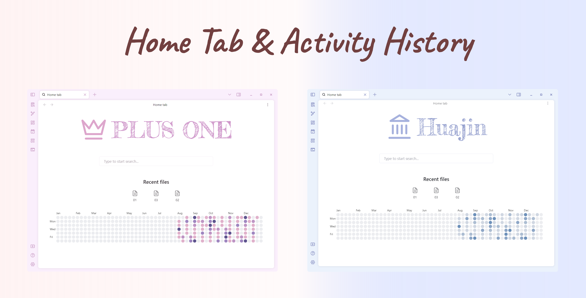
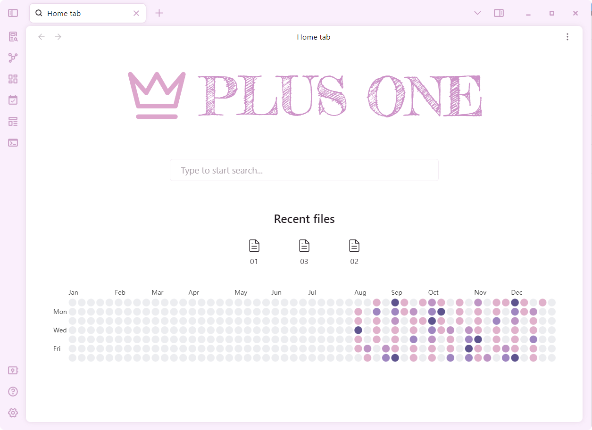
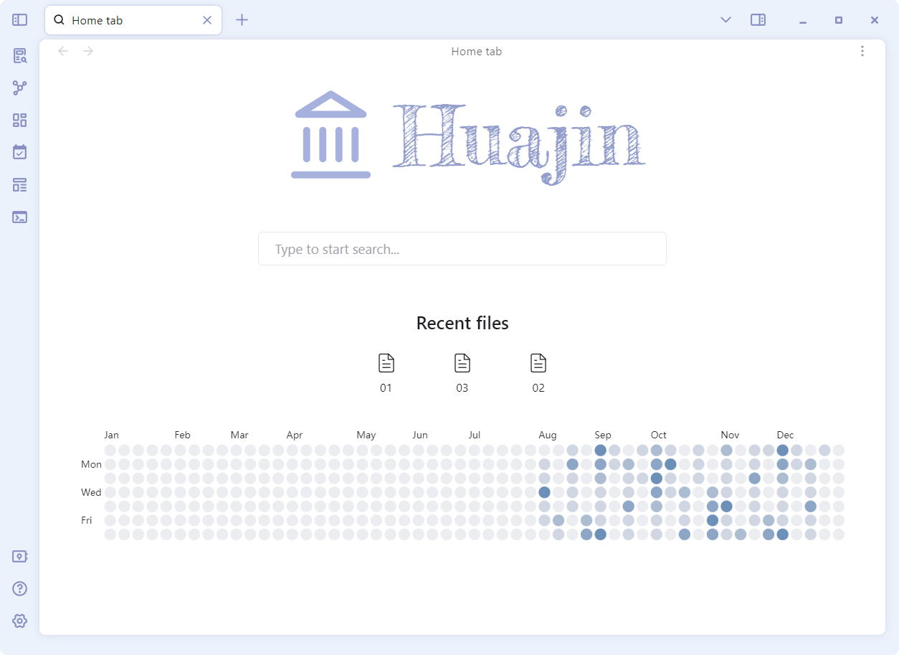

# Obsidian Home Tab & Activity History

Home Tab 插件魔改，在 Home Tab 插件的 New Tab 界面下方添加了 Activity History 插件用到的 svelte-heatmap。热力图根据你每天库的字节大小变化来确定颜色深浅，每 200s 会记录一次。

觉得好用可以给他们点点 star。

- [olrenso/obsidian-home-tab: A browser-like search tab for your local files in Obsidian. (github.com)](https://github.com/olrenso/obsidian-home-tab)
- [Darakah/obsidian-activity-history: Activity monitor for Vault & specified projects (github.com)](https://github.com/Darakah/obsidian-activity-history)
- [scottbedard/svelte-heatmap: A light weight and customizable version of GitHub's contribution graph](https://github.com/scottbedard/svelte-heatmap)

## 效果图

主题用的是 [Akifyss/obsidian-border: A theme for obsidian.md (github.com)](https://github.com/Akifyss/obsidian-border)

## 补充

插件目前还没完全完工，热力图的各种属性的修改还没写到设置中，有兴趣的可以试用，担心的可以事先保存下自己 home-tab 插件中的 data.json 文件，这里面放的是你的配置，如果丢了直接在 obsidian 的 home-tab 设置重新修改设置就行。

